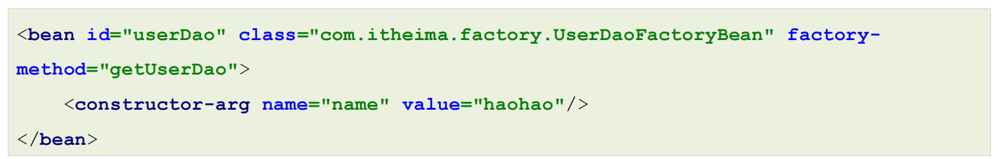

# IOC DI AOP思想
- ioc(inversion of control)控制反转   
  将程序中创建Bean对象的权力交给**第三方容器**  
  设计模式 -> 使用工厂设计模式 根据**配置文件**配置Bean对象的基本信息  

- di(dependency injection)依赖注入  
  在程序中，一些Bean对象依赖其他Bean对象 则在对象中，需要注入被依赖的对象，我们将这个权力也交给第三方，强调di也是ioc的一种实现  

- aop(aspect oriented programming)面向切面的编程
  
# Spring框架
- spring是一个开源的**轻量级**Java开发应用框架，可以简化企业级应用开发

# BeanFactory
```

        //创建工厂对象
        DefaultListableBeanFactory beanFactory =new DefaultListableBeanFactory();
        //读取Xml文件
        XmlBeanDefinitionReader reader =new XmlBeanDefinitionReader(beanFactory);
        //配置文件绑定工厂
        reader.loadBeanDefinitions("beans.xml");

        //根据id获取Bean对象实例
        UserService userService = (UserService) beanFactory.getBean("userService");
        System.out.println("获得UserService实例  "+userService);

```
- BeanFactory 在调用getBean方法的时候实例化Bean对象 (延迟加载)
- 具体的实现类一般是**DefaultListableBeanFactory**

# ApplicationContext
```
        // 加载配置文件
        ApplicationContext applicationContext =new ClassPathXmlApplicationContext("beans.xml");
        UserService userService = (UserService) applicationContext.getBean("userService");
        System.out.println(userService);    
```
- ApplicationContext底层对BeanFactory进行封装，本身是对BeanFactory的拓展和增强(监听功能、国际化功能)
- Application实现了BeanFactory 但内部也维护了BeanFactory的对象 既有实现关系也有融合关系
- BeanFactory 在调用getBean方法的时候实例化Bean对象(延迟加载) ApplicationContext 在配置文件加载完毕就创建Bean(立即加载)  
  


ApplicationContext内的重要数据结构
- beanFactory
  
- singletonObjects
- singletonFactories
- earlySingletonObjects
  
-beanDefinitionMap
  

ApplicationContext的具体实现类一般有如下三个
|  实现类 | 功能  | 
|---|---|
|  ClassPathXmlApplicationContext |  加载类路径下的xml配置的ApplicationContext | 
|  FileSystemXmlApplicationContext  | 加载磁盘路径下的xml配置的ApplicationContext  |  
|  AnnotationConfigApplicationContext |  加载注解配置类的ApplicationContext |  

# Spring的配置文件Application.xml
- 基础标签bean
  
|  Xml配置方式 |功能描述|
|---|---|
| &lt;bean id="" class=""&gt; | Bean的id和全限定名配置|
| &lt;bean name=""&gt; | 通过name设置Bean的别名，通过别名也能直接获取到Bean实例|
| &lt;bean scope=""&gt; | Bean的作用范围，BeanFactory作为容器时取值singleton和prototype|
| &lt;bean lazy-init=""&gt; | Bean的实例化时机，是否延迟加载。BeanFactory作为容器时无效|
| &lt;bean init-method=""&gt; | Bean实例化后自动执行的初始化方法，method指定方法名|
| &lt;bean destroy-method=""&gt; | Bean实例销毁前的方法，method指定方法名|
| &lt;bean autowire="byType"&gt; | 设置自动注入模式，常用的有按照类型byType，按照名字byName|
| &lt;bean factory-bean="" factory-method=""/&gt; | 指定哪个工厂Bean的哪个方法完成Bean的创建|

  scope(作用范围)
- 默认情况下，单纯的Spring环境Bean的作用范围有两个：Singleton和Prototype
  
- singleton：单例，默认值，Spring容器创建的时候，就会进行Bean的实例化，并存储到容器内部的单例池中
，每次getBean时都是从单例池中获取相同的Bean实例；
- prototype：原型，Spring容器初始化时不会创建Bean实例，当调用getBean时才会实例化Bean，每次
getBean都会创建一个新的Bean实例。

- 在web环境中，还会有request、session、global session 
***

  lazy-init(延迟加载)  
- 当lazy-init设置为true时为延迟加载，也就是当Spring容器创建的时候，不会立即创建Bean实例，等待用到时在创
建Bean实例并存储到单例池中去，后续在使用该Bean直接从单例池获取即可，本质上该Bean还是单例的
- 对于BeanFactory来说不起效果
***
init-method 和 destroy-method
- Bean在被实例化后，可以执行指定的初始化方法完成一些初始化的操作，Bean在销毁之前也可以执行指定的销毁
方法完成一些操作，初始化方法名称和销毁方法名称通过
- bean对象还可实现InitializingBean接口，重写其中的方法，实现初始化
  
- destroy-method需要显示的关闭Spring容器
***
bean的实例化配置
- bean的实例化有两种，一种是构造方法实例化，第二种是自定义工厂实例化
- 构造方法实例化有有参和无参两种，其中有参实例化的参数通过 &lt;constructor-arg&gt;标签引入
- 工厂方法实例化有三种方式
    - 静态工厂方法实例化Bean
    - 实例工厂方法实例化Bean
    - 实现FactoryBean规范延迟实例化Bean  
  
1.静态工厂
    
通过factory-method指定静态工厂方法，此时的class应为静态工厂的全限类名。此时依旧可以使用constructor-arg 传递参数。  

2.实例工厂
    
- 实例工厂方法，也就是非静态工厂方法产生Bean实例，与静态工厂方式比较，该方式需要先有工厂对象，再用工厂对象去调用非静态方法，所以在进行配置时，要先配置工厂Bean，在配置目标Bean。
- factory-bean为工厂名 factory-method为产生bean对象的具体方法
  
3.规范延迟实例化
- Spring提供了FactoryBean的接口规范
  
- FactoryBean中有getObject方法，返回值就是bean
- 此种方法，在容器创建时，存入SingletonObjects当中的value实际是实现FactoryBean接口的类，在第一次使用bean对象时，才会创建bean对象，并通过getObject方法获得，存放位置是factoryBeanObjectCache
  

***
bean的依赖注入
- bean的依赖注入有两种方式，一是通过set方法注入，二是通过构造方法注入
- bean可以注入各种类型的数据包括 普通数据类型、引用数据类型、集合数据等
- 通过set方法注入，需要的标签是 &lt;property&gt; 构造方法则是&lt;constructor-arg&gt;
  
  set方法的命名是**set+需要注入字段首字母小写**

- bean也可以自动注入引用数据类型，利用autowire="byType/byName"
  byType去容器中寻找相同类型的引用，多个则报错;byName则根据set方法后的名字寻找对应的对象。找不到的话，字段为空。
***
Spring的其他标签配置
|标签| 作用|
|---|---|
|&lt;beans>| 一般作为 xml 配置根标签，其他标签都是该标签的子标签|
|&lt;bean>| Bean的配置标签，上面已经详解了，此处不再阐述|
|&lt;import>| 外部资源导入标签|
|&lt;alias>| 指定Bean的别名标签，使用较少|


----

***
非自定义bean的配置
***

# Bean实例化的基本流程
1. BeanDefinition  
  spring会将配置的bean信息封装成一个BeanDefinition对象。在我们BeanFactory的具体实现类DefaultListableBeanFactory中维护了一个**beanDefinitionMap**用于存放beanDefinition对象。Spring容器会从beanDefinitionMap中拿到bean信息通过反射进行对象创建。
2. SingletonObjects  
   BeanDefinition会被转化成对应的Bean实例对象，存储到单例池中去，在DefaultListableBeanFactory的上四级父类
DefaultSingletonBeanRegistry中，维护着**singletonObjects**
3. 基本流程
- 加载xml配置文件，解析获取配置中的每个<bean>的信息，封装成一个个的BeanDefinition对象;
- 将BeanDefinition存储在一个名为beanDefinitionMap的Map<String,BeanDefinition>中;
- ApplicationContext底层遍历beanDefinitionMap，创建Bean实例对象;
- 创建好的Bean实例对象，被存储到一个名为singletonObjects的Map<String,Object>中;
- 当执行applicationContext.getBean(beanName)时，从singletonObjects去匹配Bean实例返回。
  
# Spring的后处理器
Spring的后处理器是Spring对外开发的重要扩展点，允许我们介入到Bean的整个实例化流程中来，以达到动态注册
BeanDefinition，动态修改BeanDefinition，以及动态修改Bean的作用。Spring主要有两种后处理器：
- BeanFactoryPostProcessor：Bean工厂后处理器，在BeanDefinitionMap填充完毕，Bean实例化之前执行；
- BeanPostProcessor：Bean后处理器，一般在Bean实例化之后，填充到单例池singletonObjects之前执行。
---
BeanFactoryPostProcessor(Bean工厂后处理器)是一个接口规范，只要实现了该接口，spring容器就会回调该接口的方法，可用于对BeanDefinition进行注册和修改。

- ConfigurableListableBeanFactory的子类DefaultListableBeanFactory有注册的方法
- Spring 提供了一个BeanFactoryPostProcessor的子接口BeanDefinitionRegistryPostProcessor专门用于注册
BeanDefinition操作
---
BeanPostProcessor(bean后处理器) 
- Bean被实例化后，到最终缓存到名为singletonObjects单例池之前，中间会经过Bean的初始化过程，例如：属性的
填充、初始方法init的执行等，其中有一个对外进行扩展的点BeanPostProcessor，我们称为Bean后处理。跟上面的
Bean工厂后处理器相似，它也是一个接口，实现了该接口并被容器管理的BeanPostProcessor，会在流程节点上被
Spring自动调用。

---
# Spring完整的生命周期

Spring Bean的生命周期是从 Bean 实例化之后，即通过反射创建出对象之后，到Bean成为一个完整对象，最终存储
到单例池中，这个过程被称为Spring Bean的生命周期。Spring Bean的生命周期大体上分为三个阶段：
- Bean的实例化阶段：Spring框架会取出BeanDefinition的信息进行判断当前Bean的范围是否是singleton的，
是否不是延迟加载的，是否不是FactoryBean等，最终将一个普通的singleton的Bean通过反射进行实例化；
- Bean的初始化阶段：Bean创建之后还仅仅是个"半成品"，还需要对Bean实例的属性进行填充、执行一些Aware
接口方法、执行BeanPostProcessor方法、执行InitializingBean接口的初始化方法、执行自定义初始化init方法
等。该阶段是Spring最具技术含量和复杂度的阶段，Aop增强功能，后面要学习的Spring的注解功能等、
spring高频面试题Bean的循环引用问题都是在这个阶段体现的；
- Bean的完成阶段：经过初始化阶段，Bean就成为了一个完整的Spring Bean，被存储到单例池
singletonObjects中去了，即完成了Spring Bean的整个生命周期

bean的初始化阶段
由于Bean的初始化阶段的步骤比较复杂，所以着重研究Bean的初始化阶段
Spring Bean的初始化过程涉及如下几个过程：
- Bean实例的属性填充
- Aware接口属性注入
- BeanPostProcessor的before()方法回调
- InitializingBean接口的初始化方法回调
- 自定义初始化方法init回调
- BeanPostProcessor的after()方法回调

---
Aware接口

Aware接口是一种框架辅助属性注入的一种思想，其他框架中也可以看到类似的接口。框架具备高度封装性，我们接
触到的一般都是业务代码，一个底层功能API不能轻易的获取到，但是这不意味着永远用不到这些对象，如果用到了
，就可以使用框架提供的类似Aware的接口，让框架给我们注入该对象。
|Aware接口 |回调方法| 作用|
|---|---|---|
|ServletContextAware| setServletContext(ServletContext context) |Spring框架回调方法注入ServletContext对象，web环境下才生效|
|BeanFactoryAware |setBeanFactory(BeanFactory factory)| Spring框架回调方法注入beanFactory对象|
|BeanNameAware| setBeanName(String beanName)| Spring框架回调方法注入当前Bean在容器中的beanName|
|ApplicationContextAware |setApplicationContext|(ApplicationContext applicationContext) Spring框架回调方法注入applicationContext对象|
---
# 三级缓存


UserService和UserDao循环依赖的过程结合上述三级缓存描述一下
- UserService 实例化对象，但尚未初始化，将UserService存储到三级缓存；
- UserService 属性注入，需要UserDao，从缓存中获取，没有UserDao；
- UserDao实例化对象，但尚未初始化，将UserDao存储到到三级缓存；
- UserDao属性注入，需要UserService，从三级缓存获取UserService，UserService从三级缓存移入二级缓存；
- UserDao执行其他生命周期过程，最终成为一个完成Bean，存储到一级缓存，删除二三级缓存；
- UserService 注入UserDao；
- UserService执行其他生命周期过程，最终成为一个完成Bean，存储到一级缓存，删除二三级缓存。
  
# Spring整合第三方框架(Mybatis)

---

---
# 基于注解的Spring应用
**@Component**
1. @Component  
   被该注解标识的类，会在指定扫描范围内被Spring加载并实例化,替代了&lt;bean>标签。可以通过注解的value属性指定当前Bean实例的beanName，也可以省略不写，不写的情况下为当前类名首字母小写。
   
2. 关于bean的其他注解    
   
  |xml配置 |注解 |描述|
  |---|---|---|
  | &lt;bean scope="">| @Scope| 在类上或使用了@Bean标注的方法上，标注Bean的作用范围，取值为singleton或prototype|
  | &lt;bean lazy-init="">| @Lazy |在类上或使用了@Bean标注的方法上，标注Bean是否延迟加载，取值为true和false|
  | &lt;bean init-method=""> |@PostConstruct| 在方法上使用，标注Bean的实例化后执行的方法|
  | &lt;bean destroy-method=""> |@PreDestroy |在方法上使用，标注Bean的销毁前执行方法|
3. 语义化
   由于JavaEE开发是分层的，为了每层Bean标识的注解语义化更加明确，@Component又衍生出如下三个注解：
      
    |@Component衍生注解| 描述|
    |---|---|
    |@Repository| 在Dao层类上使用|
    |@Service| 在Service层类上使用|
    |@Controller| 在Web层类上使用|
---
**依赖注入**
Spring主要提供如下注解，用于在Bean内部进行属性注入的：

|属性注入注解| 描述|
|---|---|
|@Value |使用在字段或方法上，用于注入普通数据|
|@Autowired| 使用在字段或方法上，用于根据类型（byType）注入引用数据|
|@Qualifier |使用在字段或方法上，结合@Autowired，根据名称注入|
|@Resource |使用在字段或方法上，根据类型或名称进行注入|

  ---

**非自定义bean**  

- 非自定义Bean不能像自定义Bean一样使用@Component进行管理，非自定义Bean要通过工厂的方式进行实例化，
使用@Bean标注方法即可，@Bean的属性为beanName，如不指定为当前工厂方法名称。

- 工厂方法所在类必须要被Spring管理-
- 如果@Bean工厂方法需要参数的话，则有如下几种注入方式：
  - 使用@Autowired 根据类型自动进行Bean的匹配，@Autowired可以省略 ；
  - 使用@Qualifier 根据名称进行Bean的匹配；
  - 使用@Value 根据名称进行普通数据类型匹配。


**其他标签的替代**
1. @Configuration  
   注解标识的类为配置类，替代原有xml配置文件，该注解第一个作用是标识该类是一个配置类，第
二个作用是具备@Component作用
2. @ComponentScan  
  组件扫描配置，替代原有xml文件中的<context:component-scan base-package=""/>
3. @PropertySource  
   注解用于加载外部properties资源配置，替代原有xml中的&lt;context:property>
4. @Import  
   用于加载其他配置类，替代原有xml中的&lt;import resource=“classpath:beans.xml”/>  
   配置Spring与MyBatis注解方式整合有个重要的技术点就是@Import，第三方框架与Spring整合xml方式很多是凭借自
定义标签完成的，而第三方框架与Spring整合注解方式很多是靠@Import注解完成的。

@Import可以导入如下三种类：
- 普通的配置类
- 实现ImportSelector接口的类
- 实现ImportBeanDefinitionRegistrar接口的类
  
    

  

**其他注解**
1. @Primary  
   注解用于标注相同类型的Bean优先被使用权，@Primary 是Spring3.0引入的，与@Component
和@Bean一起使用，标注该Bean的优先级更高，则在通过类型获取Bean或通过@Autowired根据类型进行注入时，
会选用优先级更高的
1. @Profile  
   注解的作用同于xml配置时学习profile属性，是进行环境切换使用的
   注解 @Profile 标注在类或方法上，标注当前产生的Bean从属于哪个环境，只有激活了当前环境，被标注的Bean才能被注册到Spring容器里，不指定环境的Bean，任何环境下都能注册到Spring容器里
   可以使用以下两种方式指定被激活的环境：
  - 使用命令行动态参数，虚拟机参数位置加载 -Dspring.profiles.active=test
  - 使用代码的方式设置环境变量 System.setProperty("spring.profiles.active","test");
  
---
# AOP(Aspect Oriented Programming)
- 实现技术
  动态代理技术，在运行期间，对目标对象的方法进行增强，代理对象同名方法内可
以执行原有逻辑的同时嵌入执行其他增强逻辑或其他对象的方法


xml的aop配置实现动态代理


AspectJ的通知由以下五种类型
|通知名称| 配置方式| 执行时机|
|---|---|---|
|前置通知| < aop:before > |目标方法执行之前执行|
|后置通知 |< aop:after-returning > |目标方法执行之后执行，目标方法异常时，不在执行|
|环绕通知 |< aop:around > |目标方法执行前后执行，目标方法异常时，环绕后方法不在执行|
|异常通知 |< aop:after-throwing >| 目标方法抛出异常时执行|
|最终通知 |< aop:after >| 不管目标方法是否有异常，最终都会执行|

通知方法在被调用时，Spring可以为其传递一些必要的参数
|参数类型| 作用|
|---|---|
|JoinPoint| 连接点对象，任何通知都可使用，可以获得当前目标对象、目标方法参数等信息|
|ProceedingJoinPoint| JoinPoint子类对象，主要是在环绕通知中执行proceed()，进而执行目标方法|
|Throwable| 异常对象，使用在异常通知中，需要在配置文件中指出异常对象名称|

- 还有一种advisor的配置

|代理技术| 使用条件| 配置方式|
|----|----|----|
|JDK 动态代理技术| 目标类有接口，是基于接口动态生成实现类的代理对象| 目标类有接口的情况下，默认方式|
|Cglib 动态代理技术 |目标类无接口且不能使用final修饰，是基于被代理对象动态生成子对象为代理对象|目标类无接口时，默认使用该方式；目标类有接口时，手动配置<aop:config proxytarget-class=“true”>强制使用Cglib方式|


---
注解实现aop
- 目标类被Spring容器管理、通知类被Spring管理加上@Aspect
- 通知类的通知方法添加注解 @Before @After.... 以及切点表达式
- 注解@Aspect、@Around需要被Spring解析，所以在Spring核心配置文件中需要配置aspectj的自动代理
&lt;aop:aspectj-autoproxy/> 或者在配置类上配置 @EnableAspectJAutoProxy


- 原理
  

---
# 基于AOP的声明式事务控制
   ```
   <!--        平台事务管理器 transaction-->
        <bean id="transactionManager" class="org.springframework.jdbc.datasource.DataSourceTransactionManager">
                <property name="dataSource" ref="dataSource"></property>
        </bean>

<!--        Spring提供好的事务增强-->
        <tx:advice id="txAdvice" transaction-manager="transactionManager">
                <tx:attributes>
<!--
                        name : 事务名称
                        isolation : 隔离级别 解决并发问题
                        timeout : 超时时间 -1 没有超时时间 单位是s
                        read-only : 是否只读
                        propagation : 事务传播行为 解决事务嵌套问题
-->
                        <tx:method name="*" isolation="DEFAULT" timeout="-1"></tx:method>
                </tx:attributes>
        </tx:advice>

<!--        aop事务增强-->
        <aop:config>
<!--                切点表达式-->
                <aop:pointcut id="txPointCut" expression="execution(* org.example.service.impl.*.*(..))"/>
<!--                织入-->
                <aop:advisor advice-ref="txAdvice" pointcut-ref="txPointCut"></aop:advisor>
        </aop:config>
   ```

1 平台事务管理器为Spring提供。不同的持久层框架事务操作的方式有可能不同，所以不同的持久层框架有可能会有不同的平台事务管理器实现，例如，MyBatis作为持久层框架时，使用的平台事务管理器实现是DataSourceTransactionManager。Hibernate作为持久层框架时，使用的平台事务管理器是HibernateTransactionManager。  

2  Spring事务增强的一些配置。  

```
      <tx:attributes>
          <tx:method name="方法名称"
          isolation="隔离级别"
          propagation="传播行为"
          read-only="只读状态"
          timeout="超时时间"/>
      </tx:attributes>

```

3. aop的事务增强位置配置。

-
```
<tx:advice id="myAdvice" transaction-manager="transactionManager">
    <tx:attributes>
        <!--精确匹配transferMoney方法-->
        <tx:method name="transferMoney"/>
        <!--模糊匹配以Service结尾的方法-->
        <tx:method name="*Service"/>
        <!--模糊匹配以insert开头的方法-->
        <tx:method name="insert*"/>
        <!--模糊匹配以update开头的方法-->
        <tx:method name="update*"/>
        <!--模糊匹配任意方法，一般放到最后作为保底匹配-->
        <tx:method name="*"/>
    </tx:attributes>
</tx:advice>
```

- 
  isolation属性：指定事务的隔离级别，事务并发存在三大问题：脏读、不可重复读、幻读/虚读。可以通过设置事务的隔离级别来保证并发问题的出现，常用的是READ_COMMITTED 和 REPEATABLE_READ  

|isolation属性 |解释|
|---|---|
|DEFAULT| 默认隔离级别，取决于当前数据库隔离级别，例如MySQL默认隔离级别是REPEATABLE_READ|
|READ_UNCOMMITTED| A事务可以读取到B事务尚未提交的事务记录，不能解决任何并发问题，安全性最低，性能最高|
|READ_COMMITTED| A事务只能读取到其他事务已经提交的记录，不能读取到未提交的记录。可以解决脏读问题，但是不能解决不可重复读和幻读|
|REPEATABLE_READ| A事务多次从数据库读取某条记录结果一致，可以解决不可重复读，不可以解决幻读SERIALIZABLE 串行化，可以解决任何并发问题，安全性最高，但是性能最低|

- propagation属性：设置事务的传播行为，主要解决是A方法调用B方法时，事务的传播方式问题的，例如：使用单方的事务，还是A和B都使用自己的事务等。事务的传播行为有如下七种属性值可配置    
  
|事务传播行为| 解释|
|---|---|
|REQUIRED（默认值）| A调用B，B需要事务，如果A有事务B就加入A的事务中，如果A没有事务，B就自己创建一个事务|
|REQUIRED_NEW| A调用B，B需要新事务，如果A有事务就挂起，B自己创建一个新的事务|
|SUPPORTS| A调用B，B有无事务无所谓，A有事务就加入到A事务中，A无事务B就以非事务方式执行|
|NOT_SUPPORTS| A调用B，B以无事务方式执行，A如有事务则挂起|
|NEVER| A调用B，B以无事务方式执行，A如有事务则抛出异常|
|MANDATORY| A调用B，B要加入A的事务中，如果A无事务就抛出异常|
|NESTED| A调用B，B创建一个新事务，A有事务就作为嵌套事务存在，A没事务就以创建的新事务执行|

---
# 基于注解的AOP声明式事务控制
```
@Transactional(isolation = Isolation.REPEATABLE_READ,propagation = 
Propagation.REQUIRED,readOnly = false,timeout = 5)
```

```
如果使用全注解的话，使用如下配置类的形式代替配置文件
@Configuration
@ComponentScan("com.itheima.service")
@PropertySource("classpath:jdbc.properties")
@MapperScan("com.itheima.mapper")
@EnableTransactionManagement
public class ApplicationContextConfig {
@Bean
public PlatformTransactionManager tansactionManager(DataSource dataSource){
DataSourceTransactionManager transactionManager = new DataSourceTransactionManager();
transactionManager.setDataSource(dataSource);
return transactionManager;
}
// ... 省略其他配置 ...
}
```